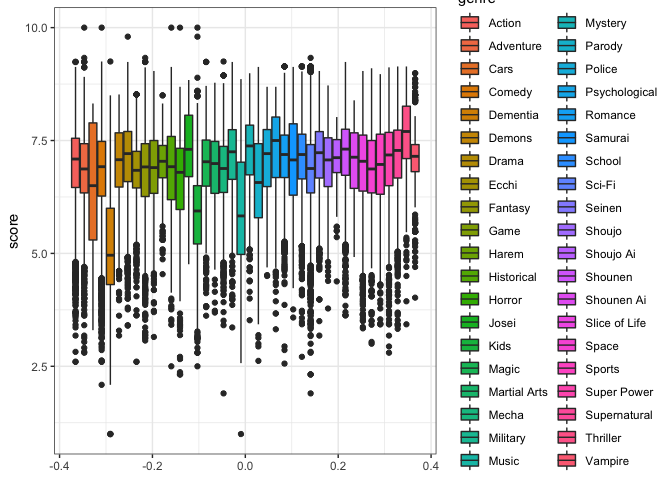
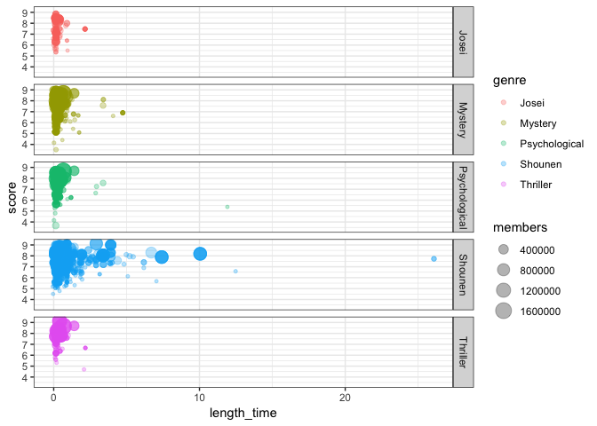
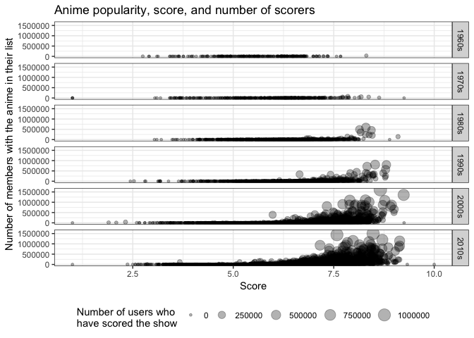

23 April 2019 - Anime
================
Alyssa Vanderbeek
4/23/2019

``` r
tidy_anime <- readr::read_csv("https://raw.githubusercontent.com/rfordatascience/tidytuesday/master/data/2019/2019-04-23/tidy_anime.csv") %>%
  dplyr::select(-synopsis, -background)
```

    ## Parsed with column specification:
    ## cols(
    ##   .default = col_character(),
    ##   animeID = col_double(),
    ##   episodes = col_double(),
    ##   airing = col_logical(),
    ##   start_date = col_date(format = ""),
    ##   end_date = col_date(format = ""),
    ##   score = col_double(),
    ##   scored_by = col_double(),
    ##   rank = col_double(),
    ##   popularity = col_double(),
    ##   members = col_double(),
    ##   favorites = col_double()
    ## )

    ## See spec(...) for full column specifications.

Exploratory analysis
--------------------

``` r
# number of genres for each show 
tidy_anime %>%
  dplyr::select(animeID, genre) %>%
  group_by(animeID) %>%
  count
```

    ## # A tibble: 13,631 x 2
    ## # Groups:   animeID [13,631]
    ##    animeID     n
    ##      <dbl> <int>
    ##  1       1     6
    ##  2       5    10
    ##  3       6     6
    ##  4       7     6
    ##  5       8     8
    ##  6      16    15
    ##  7      17     4
    ##  8      18    10
    ##  9      19    21
    ## 10      20    18
    ## # … with 13,621 more rows

``` r
# number of shows for each category 
tidy_anime %>%
  dplyr::select(animeID, genre) %>%
  group_by(genre) %>%
  count %>%
  arrange(desc(n))
```

    ## # A tibble: 41 x 2
    ## # Groups:   genre [41]
    ##    genre             n
    ##    <chr>         <int>
    ##  1 Comedy         9478
    ##  2 Action         6725
    ##  3 Fantasy        4896
    ##  4 Drama          4488
    ##  5 Adventure      4414
    ##  6 Sci-Fi         4402
    ##  7 Romance        3623
    ##  8 Shounen        3498
    ##  9 School         3351
    ## 10 Slice of Life  3179
    ## # … with 31 more rows

``` r
# average score for each genre
genre_score = tidy_anime %>%
  dplyr::select(genre, score) %>%
  group_by(genre) %>%
  summarise(mean = mean(score, na.rm = T)) %>%
  arrange(desc(mean)) %>%
  dplyr::select(genre) %>%
  unlist
```

Some questions I might in interested in exploring are: What is the distribution of scores for a given genre? Do shows that were on the air for longer have higher scores than newer shows? Do the most popular shows have the highest ratings? Importantly, what's the relationship between scores and number of users who scored?

Distribution of scores in a genre
---------------------------------

``` r
tidy_anime %>%
  dplyr::select(genre, score, popularity) %>%
  filter(genre != "NA") %>%
  group_by(genre) %>%
  ggplot(aes(y = score, fill = genre)) +
  geom_boxplot() 
```

    ## Warning: Removed 173 rows containing non-finite values (stat_boxplot).



Relationship between length of time on air and score
----------------------------------------------------

``` r
tidy_anime %>%
  mutate(length_time = as.duration(start_date %--% end_date) / dyears(1)) %>%
  filter(genre %in% genre_score[1:5]) %>%
  dplyr::select(animeID, score, length_time, genre, members) %>%
  ggplot(aes(x = length_time, y = score, size = members, color = genre)) +
  geom_point(alpha = 0.3) +
  facet_grid(genre ~ .)
```

    ## Warning: Removed 2382 rows containing missing values (geom_point).



``` r
  scale_x_continuous(limits = c(0, 10))
```

    ## <ScaleContinuousPosition>
    ##  Range:  
    ##  Limits:    0 --   10

Relationship between show popularity, show score, and number of users who scored
--------------------------------------------------------------------------------

``` r
tidy_anime %>%
  mutate(year = as.numeric(format(start_date, '%Y'))) %>% # release year
  filter(year > 1960) %>% # Most shows with dates earlier than this have missing data
  mutate(year = cut(year,
                    breaks = c(1960, 1970, 1980, 1990, 2000, 2010, Inf),
                    labels = c("1960s", "1970s", "1980s", "1990s", "2000s", "2010s"))) %>% # group year into decades
  dplyr::select(animeID, year, score, scored_by, members) %>% # select relevant cols
  unique() %>% # one row for one show
  ggplot(aes(x = members, y = score, size = scored_by)) +
  geom_point(alpha = 0.3) +
  facet_grid(year ~ .) +
  coord_flip() + 
  labs(
    title = 'Anime popularity, score, and number of scorers',
    y = 'Score',
    x = 'Number of members with the anime in their list',
    size = 'Number of users who\nhave scored the show'  
    ) +
  theme(legend.position = "bottom") 
```

    ## Warning: Removed 100 rows containing missing values (geom_point).



Initially in the above plot I was using `popularity` as a measure of popularity (it seemed like a reasonable thing to do). But I was finding that there was a negative correlation with the number of users who scored the anime, such that low values of "popularity" were scored by a large number of people. This might have made sense if the scores were low, but in fact this phenomenon was more prevalent in the higher scoring shows. Instead, I switched my measure of popularity to the `members` variable, which gives a much more intuitive measure of popularity.

From this figure we can see that higher scores are actually associated with greater popularity and a greater number of scorers. Newer shows (after 2000) are also more popular and more highly scored than older shows.
